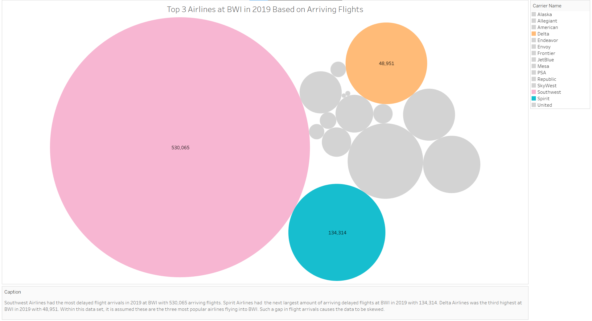

# The Best Airline to Fly Based on Delay Statistics
## Cora Wagner

For this project, I selected a data set from The Bureau of Transportation on airline delays. I wanted to take a look at what airline is best to fly at BWI over the span of three years before the Covid-19 shutdown (2017-2019). The determination of best airline is based off of calculating the top three airlines off of total number of arriving delays. If an airline has an ability to have a high number of delays, there is a chance they have a high number of flights. The top three airlines were then compared based on delay causes. From that the best airline was determined of the top three, and that airlines delay causes were broken down over the span of each year. This shows a trend in delays getting better or worse over the years. The last comparison takes the best and worst airlines of the top three and displays the numbers of each delay cause.

The data, as mentioned previously, was created by The Bureau of Transportation since they have access to flight data. Their website had a nice GUI for users to clean the data they would like to look at before they download an Excel sheet. It was here that I selected to have all airports and all airlines within the 2017-2019 time period. Having a broad range of airports and airlines allowed to me re-ask questions as I was playing with the data in Tableau. In the end, I used Baltimore-Washington International (BWI) airport as the standard airport in my research since that is the airport that my fiancé and I fly in and out of the most.

Once I decided the airport, I looked at the total number of delayed flights each airline had at BWI. I am making a correlation between number of flights and number of delays to determine that Southwest Airlines, Spirit Airlines, and Delta Airlines are the top three airlines at BWI. Meaning they are the airlines flown the most by travelers at BWI.

Now that we have the top three airlines at BWI, I broke down the delay causes to compare the airlines based on delays.
Southwest had the most carrier delays in 2019 while Delta had the least of the top three airlines.

Southwest had the most Late aircraft delays in 2019 while Delta had the least of the top three airlines.

Southwest had the most National Aviation System (NAS) delays in 2019 while Delta had the least of the top three airlines.

Southwest had the most security delays in 2019 while Delta had the least of the top three airlines.

Southwest had the most weather delays in 2019 while Delta had the least of the top three airlines.

Based on the prior graphs, Delta is the airline with the least delays in the top three airlines. Now I will breakdown Delta's delay causes for each year (2017-2019).
The pie charts show that Delta improved their delays between 2017 and 2019. Each year most of the categories decreased, except NAS and late aircraft delays.

The last graph compares Southwest to Delta. It shows the massive difference in delays for Southwest and Delta.

Based on this data, Delta is the best airline to fly if you want a popular airline and a smaller chance of delays. 

Delta was determined as being a top airline by having enough flights to have a high number of delays, but not have the most delays such as Southwest Airlines. It was then determined that Delta had the least number of NAS, Late Aircraft Arrival, Security, Weather, and Carrier delays making it the best of the top three airlines. It was also determined that 2019 was the best year for Delta concerning delays by reducing the number of delays from 2018 and being close to reducing the number of delays from 2017. We were then able to see that there was a drastic difference in Delta and Southwest Airlines delays causes by graphing them side-by-side.

[Airline Delays Data Set](https://www.transtats.bts.gov/OT_Delay/OT_DelayCause1.asp)
